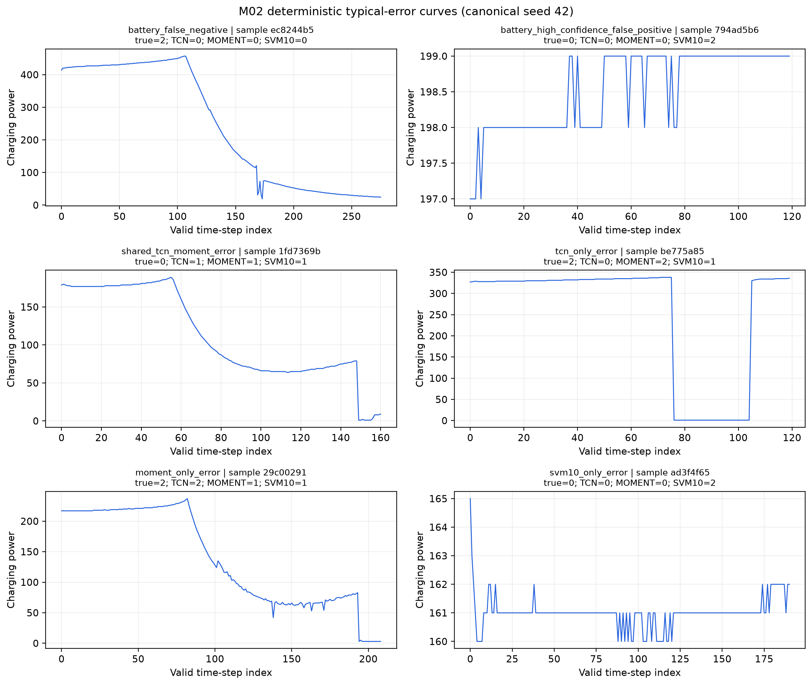

# M02 轻量错误分析（2026-08-05）

## 1. 实验目的与结论

本实验复用 TCN、完全微调 MOMENT 和低标签 MOMENT-SVM 的已有 checkpoint，在统一五随机种子
测试集上保存逐样本类别分数，并分析主要混淆方向、电池异常漏检、高置信误报、有效长度分层和
固定规则错误曲线。实验不重新训练模型，也不按曲线视觉效果挑选样本。

完整标签 TCN 和 MOMENT 的总体误差接近，但失效结构不同。TCN 的主要混淆为标签 0→1、1→0、
2→0；完全微调 MOMENT 为 0→2、1→2、2→0。两者都在最长序列区间下降，TCN 从最短区间的
96.61% Macro-F1 降至最长区间的 92.98%，MOMENT 从中间两个区间约 96% 降至最长区间的
93.87%。低标签 MOMENT-SVM 在四个长度区间均明显更弱，且 1%–10% 条件的主要电池异常错误
始终为 2→0。

## 2. 固定分析协议

- 模型：完整标签原始尺度 TCN、完全微调 MOMENT、1%/5%/10% 标签 MOMENT-SVM。
- 随机种子：42、43、44、45、46；相同 seed 的模型共享 split manifest。
- 每个模型—seed 组合保存验证集 3,510 条和测试集 7,020 条逐样本预测。
- 神经网络原生类别分数为 softmax 概率；SVM 原生分数为 one-vs-rest decision function。
- SVM 另保存 decision score 的 softmax 归一化值，只用于模型内部排序，明确不解释为校准概率。
- “高置信电池预测”固定定义为同一模型、同一 seed 中，被预测为标签 2 的样本里 prediction
  margin 位于前 10% 的集合；高置信误报是该集合中的真实非标签 2 样本。
- 有效长度为 `min(原始解析长度, max_length)`。以 seed 42 全部有效输入的最近邻四分位点固定
  四个区间：≤237、238–332、333–439、>439；不使用类别标签确定边界。
- 曲线选样固定使用 seed 42，依次选择：电池漏检、高置信电池误报、TCN/MOMENT 共同错误、
  仅 TCN 错误、仅 MOMENT 错误、仅 10% MOMENT-SVM 错误。每条规则按预先规定的置信边际排序，
  相同分数按 sample ID 排序，且排除前序规则已经选过的样本。

## 3. 每类主要错误方向

下表给出测试集五种子的每 seed 平均错误数及其占真实类别的平均比例。

| 模型 | 真实 0 的主要去向 | 真实 1 的主要去向 | 真实 2 的主要去向 |
|---|---:|---:|---:|
| TCN（100%） | 0→1：31.2（1.29%） | 1→0：38.8（1.94%） | 2→0：143.0（5.51%） |
| MOMENT 完全微调（100%） | 0→2：50.0（2.06%） | 1→2：18.2（0.91%） | 2→0：160.6（6.19%） |
| MOMENT-SVM（1%） | 0→2：540.0（22.29%） | 1→0：304.8（15.21%） | 2→0：694.2（26.77%） |
| MOMENT-SVM（5%） | 0→2：382.0（15.77%） | 1→0：189.6（9.46%） | 2→0：607.0（23.41%） |
| MOMENT-SVM（10%） | 0→2：348.8（14.40%） | 1→0：138.4（6.91%） | 2→0：536.2（20.68%） |

完整标签模型的五种子平均行归一化混淆矩阵如下。

| 模型 | 真实类别 | 预测 0 | 预测 1 | 预测 2 |
|---|---:|---:|---:|---:|
| TCN | 0 | 98.44% | 1.29% | 0.27% |
| TCN | 1 | 1.94% | 97.17% | 0.90% |
| TCN | 2 | 5.51% | 1.82% | 92.66% |
| MOMENT 完全微调 | 0 | 95.99% | 1.95% | 2.06% |
| MOMENT 完全微调 | 1 | 0.65% | 98.44% | 0.91% |
| MOMENT 完全微调 | 2 | 6.19% | 1.69% | 92.12% |

## 4. 电池异常漏检与高置信误报

| 模型 | FN / seed | 漏检率 | FP / seed | 误报率 | 高置信 FP / seed |
|---|---:|---:|---:|---:|---:|
| TCN（100%） | 190.2 ± 36.5 | 7.34% ± 1.41% | 24.6 ± 7.3 | 0.56% ± 0.16% | 0.4 ± 0.9 |
| MOMENT 完全微调（100%） | 204.4 ± 24.3 | 7.88% ± 0.94% | 68.2 ± 4.4 | 1.54% ± 0.10% | 0.8 ± 0.8 |
| MOMENT-SVM（1%） | 1000.0 ± 117.0 | 38.57% ± 4.51% | 788.0 ± 78.4 | 17.80% ± 1.77% | 16.0 ± 6.2 |
| MOMENT-SVM（5%） | 792.0 ± 43.1 | 30.54% ± 1.66% | 544.8 ± 95.5 | 12.31% ± 2.16% | 7.8 ± 2.6 |
| MOMENT-SVM（10%） | 689.0 ± 35.6 | 26.57% ± 1.37% | 478.8 ± 47.5 | 10.82% ± 1.07% | 6.8 ± 2.6 |

这里的高置信集合是每个运行内部的相对前 10%，不能解释为跨模型共享的绝对概率阈值。完整标签
TCN 的漏检、误报和高置信误报均低于完全微调 MOMENT；低标签 MOMENT-SVM 的总体 Macro-F1
优势结论不能外推为安全类别优势。

## 5. 有效长度分层 Macro-F1

| 模型 | ≤237 | 238–332 | 333–439 | >439 |
|---|---:|---:|---:|---:|
| TCN（100%） | 96.61 ± 0.83 | 96.40 ± 0.74 | 95.59 ± 0.78 | 92.98 ± 1.43 |
| MOMENT 完全微调（100%） | 93.46 ± 0.90 | 96.16 ± 0.76 | 95.85 ± 0.39 | 93.87 ± 0.77 |
| MOMENT-SVM（1%） | 62.38 ± 1.76 | 66.22 ± 2.37 | 67.11 ± 1.82 | 59.62 ± 4.41 |
| MOMENT-SVM（5%） | 72.83 ± 2.00 | 76.96 ± 1.38 | 77.13 ± 1.63 | 70.82 ± 3.73 |
| MOMENT-SVM（10%） | 76.43 ± 0.88 | 80.40 ± 0.94 | 80.54 ± 1.01 | 75.41 ± 1.68 |

每个 seed 的四区间平均样本数依次为 1,763.8、1,761.0、1,755.8 和 1,739.4。五种模型的
最低或次低表现均出现在最长区间；完全微调 MOMENT 在最短区间还存在额外下降。

## 6. 固定规则错误曲线与描述性特征

五种子 `(seed, sample_id)` 测试单元中，TCN 与完全微调 MOMENT 共同错误 585 个，仅 TCN
错误 839 个，仅 MOMENT 错误 1,079 个，两者均正确 32,597 个。相对两者均正确组：共同错误
曲线的变化方向转折率中位数更高（0.261 vs 0.195），功率极差略高（194 vs 185）；仅 TCN
错误曲线更长（399 vs 331），整体斜率数值更高（−147 vs −185）；仅 MOMENT 错误曲线的变化
方向转折率更高（0.304 vs 0.195），整体斜率数值也更高（−157 vs −185）。这些是固定特征上的
描述性差异，不作为因果解释。

图中六条曲线由协议规则直接选出，论文图只展示 sample ID 的 SHA-256 前 8 位。完整内部 ID、
选择得分、三模型预测和类别分数保留在机器可读结果包中。

## 7. 完整性核验与产物

- 正式状态：`COMPLETED`，退出码 0；首次完整推理与分析约 1,196.7 秒。
- 逐样本预测：25 个 CSV，共 263,250 行 validation/test 记录；测试子集共 175,500 行。
- 每个模型—seed 测试组严格为 7,020 条，无重复 `(model, seed, sample_id)`。
- 三个归一化类别分数逐行和为 1，全部为有限值；SVM 原生 decision score 同时独立保存。
- 长度分层 100 条逐 seed 指标；混淆矩阵 225 个逐 seed 单元；固定规则曲线 6 条且 ID 不重复。
- 结果目录：`artifacts/m02_error_analysis_20260805/`。
- 入口：`src/tcn_moment/evaluate_error_analysis.py`；远程脚本：
  `scripts/run_m02_error_analysis_remote.sh`。
- 本地归档：`artifacts/imports/m02_error_analysis_20260805.tar.gz`，共 46 个归档条目，
  SHA-256：`a2f5c90fb8182d402ea3d374e616703337d5380ec336cffe225926ec1d631a10`。

## 8. 对论文结论的影响

M02 补齐了逐样本分数、逐类别混淆、典型错误曲线和长度分层证据。结果没有改变论文的模型选择
边界：完整标签下 TCN 与 MOMENT 效果接近但 TCN 安全类别表现和资源权衡更好；低标签
MOMENT-SVM 的价值仍是总体标签效率，而不是电池异常安全性能。最长序列是所有方案共同的相对
薄弱区间，后续人工复核或鲁棒性实验应优先覆盖该区间。
