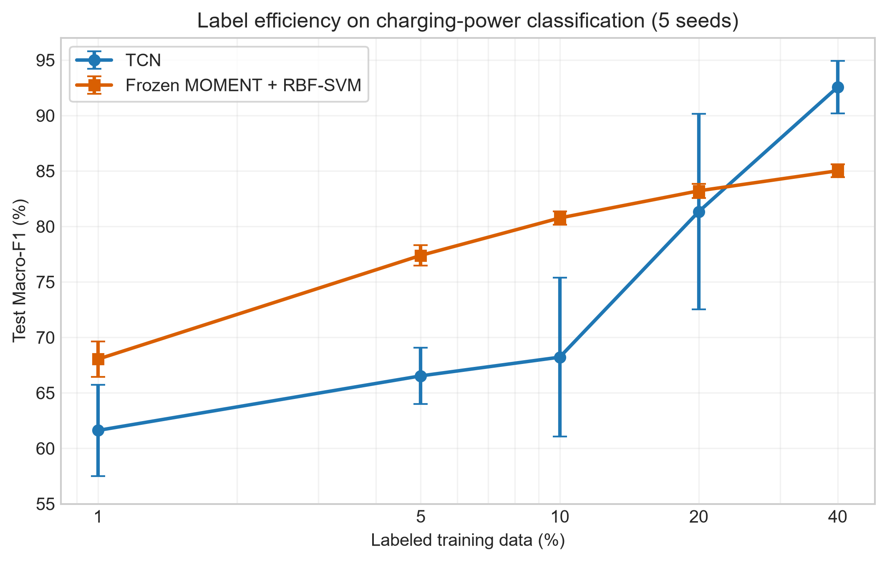
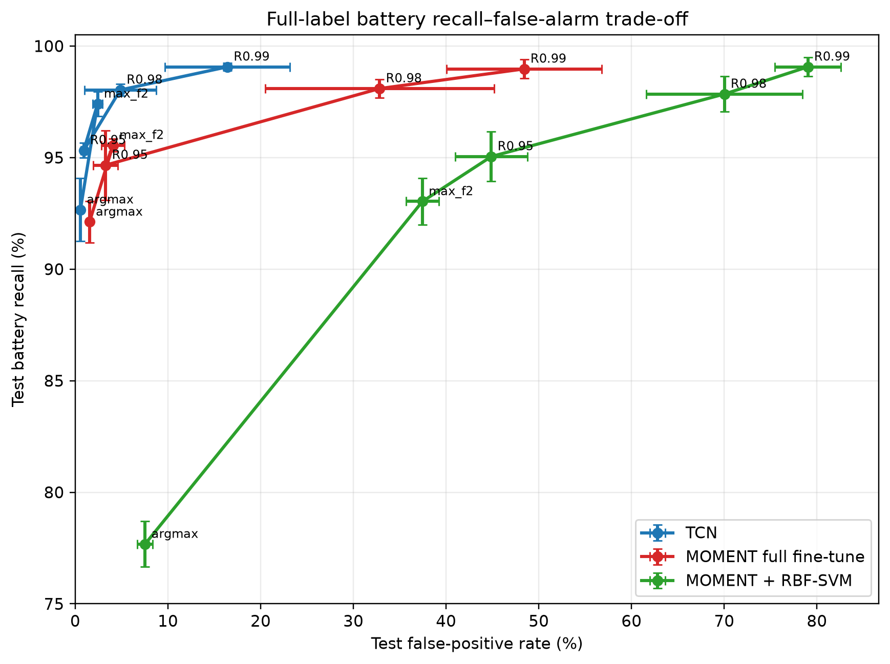
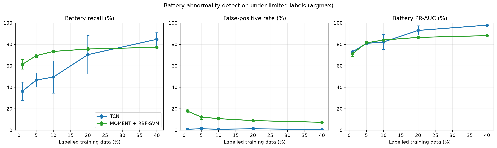
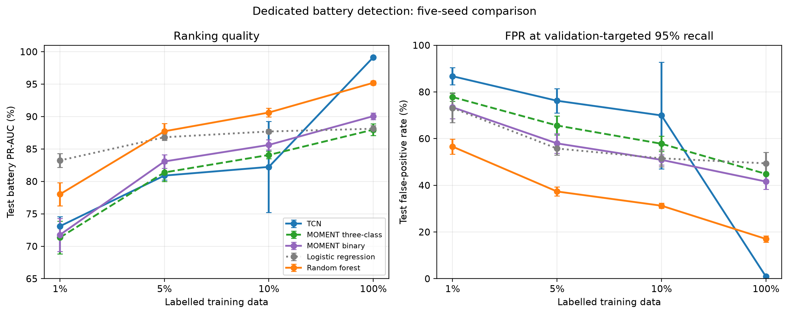
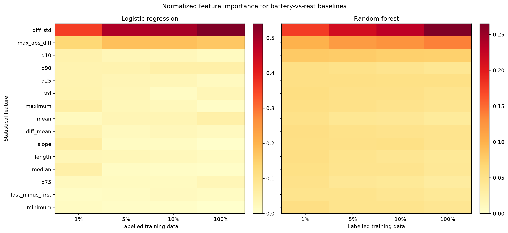
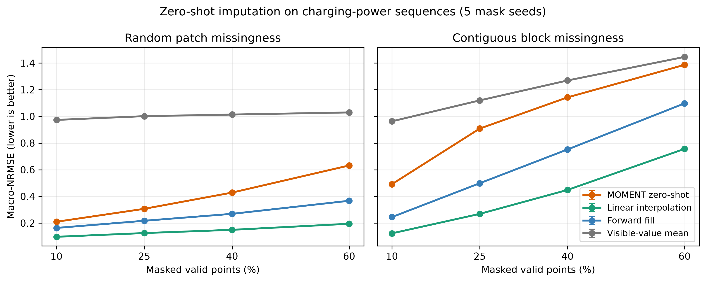
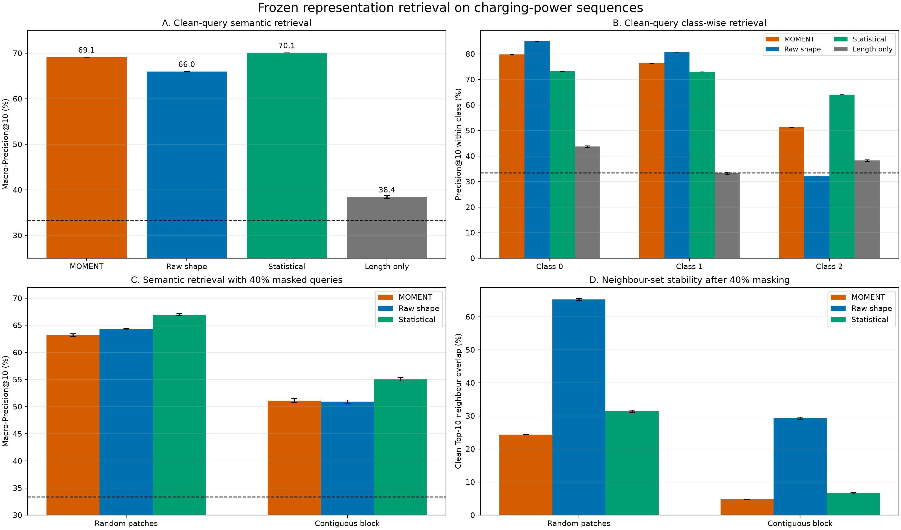

# 充电功率时序分类与 MOMENT 迁移能力综合实验报告

> 报告日期：2026-08-04；M01 更新：2026-08-05
> 数据集 SHA-256：`5615a96a7894caed5d14463c77167af8098bdc1e1ebf32a33a89a12c3c5cf6e6`  
> 主要算力：Tesla V100-PCIE-32GB  
> 正式统计：五个随机种子，均值 ± 样本标准差  
> 适用范围：毕业论文实验章节、答辩材料和项目复现实验总览

## 摘要

本项目围绕充电功率变长时间序列的三分类任务，对统计学习、轻量卷积网络、TCN 和通用时序
基础模型 MOMENT-1-large 进行了统一协议比较，并进一步考察了归一化、微调深度、标签效率、
电池异常安全关键指标、零样本缺失值插补和无监督相似序列检索。

实验得到五项核心结论：

1. **标签充足时，TCN 是效果—成本比最优的方案。**不进行逐序列归一化的 TCN 取得
   95.99% ± 0.73% Macro-F1；完全微调 MOMENT 为 95.37% ± 0.39%，平均效果接近，
   但 MOMENT 的训练时间、显存和参数量分别约为 TCN 的 31.5、58.5 和 1,560 倍。
2. **MOMENT 的主要优势是低标签条件下的标签效率与稳定性。**在 1%、5%、10% 标签下，冻结
   MOMENT + RBF-SVM 比从头训练 TCN 分别高 6.43、10.86 和 12.55 个 Macro-F1 百分点；
   40% 标签时 TCN 反超 7.54 个百分点。同架构、同 RBF-SVM 的消融中，预训练表征相对随机
   初始化表征在前三个比例分别提高 28.60、22.58、22.01 个百分点，95% 配对区间均高于 0。
3. **电池异常检测不能只看总体准确率。**完整标签下，验证集最大 F2 阈值的 TCN 取得
   97.41% ± 0.56% Battery Recall 和 2.41% ± 0.52% FPR，均优于完全微调 MOMENT；在 1%–5%
   标签和相同高召回目标下，专用二分类 MOMENT 比三分类版本减少误报，但 Random Forest
   更强；完整标签 TCN 仍明显最好，当前任何方法都不满足安全部署要求。
4. **MOMENT 需要与任务匹配的适配方式。**冻结线性头、最后两层微调、冻结表征 RBF-SVM 和
   完全微调的 Macro-F1 依次为 77.41%、81.50%、85.17% 和 95.37%。非线性下游分类器
   优于浅层解冻，而充分微调才能释放接近 TCN 的任务上限。
5. **跨任务收益具有明确边界。**MOMENT 零样本插补在所有 8 个缺失条件下均未超过线性插值；
   无监督检索 Macro-Precision@10 为 69.12%，超过原始曲线和长度基线，但略低于人工统计
   特征的 70.08%。因此不能笼统声称基础模型在所有任务上都更优。

综合而言，本文不支持“用大模型替代所有专用模型”的结论，而支持一种更具体的选择原则：
低标签冷启动优先使用冻结 MOMENT 表征，标签充足且强调部署效率时使用 TCN，算力充足且必须
使用 MOMENT 时采用完全微调；安全报警必须单独优化 Recall–FPR 权衡，跨任务零样本应用必须
单独验证。

## 1. 研究问题与实验结构

| 编号 | 研究问题 | 对应实验 |
|---|---|---|
| RQ0 | 内部数据处理与标签口径是否一致？ | 数据协议检查、长度决策树 |
| RQ1 | 完整标签下哪类模型效果最好？ | 统计基线、CNN、TCN、MOMENT 主对比 |
| RQ2 | 输入归一化如何影响 TCN？ | none、逐序列 z-score、逐序列 minmax |
| RQ3 | MOMENT 需要多深的任务适配？ | 线性探测、最后两层微调、RBF-SVM、完全微调 |
| RQ4 | 预训练表征能否提高标签效率？ | 少样本实验、同架构预训练—随机初始化消融 |
| RQ5 | MOMENT 能否零样本执行分类之外的重构任务？ | 随机/连续缺失值插补 |
| RQ6 | 冻结表征能否直接用于相似序列搜索？ | 无监督检索与遮挡查询鲁棒性 |
| RQ7 | 取得效果需要多少算力？ | 吞吐、训练时间、显存和参数量对照 |
| RQ8 | 电池异常能否同时少漏检、少误报？ | one-vs-rest、PR-AUC、验证集高召回阈值 |

实验按“数据协议检查 → 统一分类主表 → 模型消融 → 标签效率 → 跨任务扩展”的顺序开展。早期结果
若数据协议不同或实现存在缺陷，只作为诊断材料，不进入正式主表。

## 2. 数据、划分与评价协议

### 2.1 数据清洗

| 项目 | 数值 |
|---|---:|
| 原始记录 | 46,535 |
| 原始标签 0 / 1 / 2 / 5 | 12,115 / 10,020 / 12,965 / 11,435 |
| 长度小于 18 的记录 | 10,614 |
| 过滤后有效三分类记录 | 35,099 |
| 有效标签 0 / 1 / 2 | 12,115 / 10,020 / 12,964 |
| 原始最短 / 最长序列 | 1 / 816 |
| 有效数据最大长度 | 816 |

数据为真实内部运行资源，0/1/2/5 沿用现行业务标签定义；旧版 TCN 代码与模型已经投入实际使用。
本报告在该既有业务口径上评估统一协议 TCN、传统基线与 MOMENT。

标签 5 中有 10,613 条短于 18 个点，中位长度为 1，且 9,101 条为恒定序列，数据特征支持将
其视为无效或不完整记录。过滤后有效数据没有完全重复序列或冲突标签，只有 4 条恒定序列；
`max_length=1024` 时没有有效序列被截断。

标签 5 按内部既定数据协议过滤，不进入 0/1/2 三分类训练与主评估。

### 2.2 统一划分

- 随机种子：42、43、44、45、46。
- 每个种子执行分层随机划分：训练 24,569、验证 3,510、测试 7,020。
- 同一种子下所有模型共享完全相同的 `split_manifest.json`。
- 三个 split 的样本 ID 无交集，并集严格等于全部 35,099 条有效记录。
- 验证集用于模型选择和早停，测试集只用于最终评价。
- 主要指标为 Accuracy、Balanced Accuracy、Macro-F1 和 Weighted-F1；论文以 Macro-F1
  为首要分类指标。

### 2.3 长度捷径审计

仅使用序列长度训练深度为 3 的决策树，测试结果为 45.60% Accuracy 和 35.76% Macro-F1，
高于多数类的 36.94% Accuracy，说明序列长度是当前业务任务中的有效属性，但长度本身不足以
完成可靠分类。所有深度模型均使用 mask 排除 padding；后续无监督检索还单独加入 Length Only
基线，以量化动态功率信息相对长度信息的增益。

## 3. 实验完整性与纳入规则

| 实验组 | 完成情况 | 报告用途 |
|---|---:|---|
| 多数类、逻辑回归、随机森林 | 各 5/5 seeds | 正式主表 |
| 1D-CNN（z-score） | 5/5 seeds | 主表参考，保留 FP32 补跑建议 |
| TCN 三种归一化 | 各 5/5 seeds | 正式主表与归一化消融 |
| MOMENT v2 四种适配策略 | 各 5/5 seeds | 正式主表与策略消融 |
| TCN/MOMENT 少样本 | 25/25 + 5/5 套件 | 正式标签效率结果 |
| MOMENT 零样本插补 | 40/40 条件 | 正式负结果/迁移边界 |
| MOMENT 无监督检索 | 33/33 方法—条件 | 正式扩展任务结果 |
| 旧四分类 TCN、初始 MOMENT、MOMENT v1 | 不同协议或实现缺陷 | 仅诊断，不进入主表 |
| 单 epoch 执行优化对照 | 全部跑通 | 只评价效率，不评价最终效果 |

## 4. 完整标签分类主结果

下表均为五个随机种子的测试集百分数。MOMENT v1 因池化时混入 padding patch 被排除，表中
只使用 mask-aware pooling 的 v2 结果。

| 模型或策略 | Accuracy | Balanced Accuracy | Macro-F1 | 说明 |
|---|---:|---:|---:|---|
| 多数类 | 36.94 ± 0.00 | 33.33 ± 0.00 | 17.98 ± 0.00 | 机会参考 |
| 逻辑回归（统计特征） | 74.13 ± 0.59 | 73.68 ± 0.59 | 73.75 ± 0.60 | 线性统计基线 |
| 随机森林（统计特征） | 88.85 ± 0.23 | 88.90 ± 0.24 | 88.89 ± 0.23 | 强非线性基线 |
| 1D-CNN（z-score） | 94.29 ± 1.27 | 94.45 ± 1.21 | 94.38 ± 1.27 | 当前为 AMP 运行 |
| TCN（minmax） | 91.79 ± 1.37 | 92.18 ± 1.33 | 92.00 ± 1.37 | 逐序列 minmax |
| TCN（z-score） | 94.92 ± 1.44 | 95.06 ± 1.46 | 95.02 ± 1.43 | 逐序列 z-score |
| **TCN（none）** | **95.94 ± 0.74** | **96.09 ± 0.67** | **95.99 ± 0.73** | 完整标签首选 |
| MOMENT 线性探测 v2 | 77.02 ± 0.88 | — | 77.41 ± 0.89 | 只训练 3,075 参数 |
| MOMENT 最后两层微调 | 81.08 ± 1.13 | — | 81.50 ± 1.06 | 解冻 2/24 层 |
| MOMENT 冻结表征 + RBF-SVM | 84.77 ± 1.04 | 85.26 ± 1.03 | 85.17 ± 1.03 | 论文方法对齐 |
| **MOMENT 完全微调** | **95.26 ± 0.41** | **95.52 ± 0.39** | **95.37 ± 0.39** | 充分任务适配 |

### 4.1 基线与专用网络

随机森林达到 88.89% Macro-F1，说明均值、极值、分位数、斜率和突变等统计量已包含很强的
类别信息。保留该强基线非常重要：深度模型需要证明的不只是优于多数类，而是能够超过有效的
人工特征。

TCN（none）相对随机森林提高 7.09 个百分点，配对 95% t 区间为 [6.21, 7.98]；五个 seed
均提升。TCN 比 CNN 平均高 1.61 个百分点，但区间为 [−0.38, 3.61]，不能写成统计上显著
优于 CNN。TCN 三个类别的 F1 为 95.60%、96.65% 和 95.72%，表现较均衡。

### 4.2 TCN 与完全微调 MOMENT

完全微调 MOMENT 的 Macro-F1 为 95.37% ± 0.39%，与 TCN 的 95.99% ± 0.73% 相差
0.62 个百分点；相同种子的配对区间跨过 0，没有证据表明二者在平均分类效果上存在稳定差异。
MOMENT 三类 F1 为 94.50%、97.00% 和 94.60%，也没有明显类别塌缩。

但工程结论不同：TCN 只需 218,691 个参数和约 267 MiB 显存，MOMENT 完全微调需要
341,243,395 个参数和约 15.25 GiB 显存。二者效果接近时，TCN 的性能—资源权衡明显更优。

## 5. 归一化消融

| TCN 输入处理 | 最佳验证 Macro-F1 | 测试 Macro-F1 |
|---|---:|---:|
| none | **96.08 ± 0.70** | **95.99 ± 0.73** |
| z-score | 95.29 ± 1.25 | 95.02 ± 1.43 |
| minmax | 92.38 ± 1.45 | 92.00 ± 1.37 |

配对结果：

- none − z-score：+0.97 pp，95% CI `[−0.55, 2.49]`；均值更高但区间跨 0。
- z-score − minmax：+3.01 pp，95% CI `[0.86, 5.16]`。

逐序列 z-score 和 minmax 会消除样本间绝对功率幅值，而 raw TCN 最好，说明绝对幅值是当前
业务任务中的有效判别信息。训练集全局标准化仍是值得补充的对照，用于量化保留跨样本幅值差异
与统一数值尺度的组合效果。

## 6. MOMENT 适配策略消融

| 策略 | 可训练参数 | Macro-F1 | 相对上一策略 |
|---|---:|---:|---:|
| 冻结 backbone + 线性头 | 3,075（约 0.001%） | 77.41 ± 0.89 | — |
| 解冻最后 2/24 层 | 25,697,283（约 7.53%） | 81.50 ± 1.06 | +4.09 pp |
| 冻结表征 + RBF-SVM | backbone 0；SVM 最多 10,000 样本 | 85.17 ± 1.03 | +3.67 pp（相对最后两层） |
| 完全微调 | 341,243,395（100%） | 95.37 ± 0.39 | +10.20 pp（相对 RBF-SVM） |

冻结表征 + RBF-SVM 对齐 [MOMENT 论文](https://arxiv.org/abs/2402.03885)及官方分类教程的
主要下游评价思路：冻结 1024 维表示，只在训练集内执行五折交叉验证选择 `C`。它比线性头高
7.75 个百分点，也比最后两层微调高 3.67 个百分点，说明冻结表示具有明显的非线性可分性。

“解冻最后两层”是本文设计的浅层部分微调消融，不是 MOMENT 原论文方法。其最好 Accuracy
只有 81.89%，不能写成“MOMENT 部分微调最高只能达到 80%”；正确结论是当前 2/24 层、学习率
和训练协议不足以完成深层领域适配。完全微调五个 seed 均超过 94.7% Accuracy，证明模型容量
足够，但需要显著更多算力。

## 7. 少样本标签效率

每个 seed 中，TCN 与 MOMENT 使用相同、分层且嵌套的训练样本 ID；验证集和测试集保持完整。
实际训练样本数依次为 244、1,227、2,456、4,913 和 9,827。

| 标签比例 | TCN Macro-F1 | MOMENT + RBF-SVM Macro-F1 | MOMENT − TCN |
|---:|---:|---:|---:|
| 1% | 61.62 ± 4.12 | **68.05 ± 1.59** | **+6.43 pp** |
| 5% | 66.54 ± 2.54 | **77.40 ± 0.93** | **+10.86 pp** |
| 10% | 68.22 ± 7.15 | **80.77 ± 0.59** | **+12.55 pp** |
| 20% | 81.34 ± 8.80 | 83.21 ± 0.63 | +1.87 pp |
| 40% | **92.57 ± 2.36** | 85.03 ± 0.58 | **−7.54 pp** |

配对 95% t 区间在 1%、5%、10% 标签下均不含 0；20% 为 `[−9.53, 13.27]`，无法判断
稳定差异；40% 为 `[−10.59, −4.50]`，TCN 明显占优。由于只有五个 seed 且没有多重比较
校正，报告应强调效应量、趋势和方差，而不是只使用“显著”一词。

MOMENT 在少标签下的标准差只有 0.58–1.59 个百分点，而 TCN 为 2.36–8.80 个百分点。
结果表明 MOMENT 适合低标签冷启动；冻结表征约在 85% Macro-F1 附近饱和，标签增多后 TCN
能继续学习目标域判别特征，并在 40% 标签处接近完整数据上限。

### 7.1 同架构预训练归因简化消融

为隔离预训练权重的作用，在 1%、5%、10% 标签和 seeds 42–46 下，将预训练 MOMENT 与相同
341,243,395 参数的随机初始化 MOMENT 比较。两条件冻结 encoder，共享相同 split、训练样本 ID、
z-score、mask-aware pooling、1,024 维特征和 RBF-SVM 五折 C 网格；随机条件直接构造模型，
不调用 `from_pretrained`，产物明确记录未加载 checkpoint。

| 标签比例 | 预训练 Macro-F1 | 随机初始化 Macro-F1 | 配对差 | 95% 配对区间 |
|---:|---:|---:|---:|---:|
| 1% | **68.05% ± 1.59%** | 39.44% ± 5.00% | **+28.60 pp** | **[+22.24, +34.97] pp** |
| 5% | **77.40% ± 0.93%** | 54.81% ± 0.95% | **+22.58 pp** | **[+20.89, +24.28] pp** |
| 10% | **80.77% ± 0.59%** | 58.76% ± 1.26% | **+22.01 pp** | **[+20.48, +23.53] pp** |

15 个逐 seed 差值全部为正，自动协议检查全部通过。结果支持“预训练权重提高当前任务的低标签
分类性能”，同时不改变 MOMENT—TCN 比较仍属于各自既定管线的边界。完整记录见
[M01 预训练归因简化消融](experiment_records/m01_pretraining_ablation_20260805.md)。

## 8. 电池异常安全关键评估

将标签 `2` 视为电池异常正类，对 45 个已完成运行恢复最佳 checkpoint/SVM，并在 validation 和
test 导出连续分数。阈值只在 validation 上按最大 F2 或目标 Recall 选择，再原样用于 test；共
得到 65 个模型/标签比例结果和 325 行逐 seed 运行点指标，没有重新训练模型。

### 8.1 完整标签结果

| 运行点 | 模型 | Battery Recall | Precision | FPR | F2 | 平均 FN / FP |
|---|---|---:|---:|---:|---:|---:|
| Argmax | TCN | **92.66 ± 1.41** | **98.99 ± 0.29** | **0.56 ± 0.16** | **93.86 ± 1.14** | 190.2 / 24.6 |
| Argmax | MOMENT 完全微调 | 92.12 ± 0.94 | 97.22 ± 0.17 | 1.54 ± 0.10 | 93.09 ± 0.76 | 204.4 / 68.2 |
| Max-F2 | TCN | **97.41 ± 0.56** | **95.95 ± 0.85** | **2.41 ± 0.52** | **97.11 ± 0.48** | 67.2 / 106.8 |
| Max-F2 | MOMENT 完全微调 | 95.56 ± 0.29 | 93.25 ± 1.91 | 4.07 ± 1.25 | 95.08 ± 0.46 | 115.2 / 180.4 |
| 99% Recall 目标 | TCN | **99.07 ± 0.18** | **78.45 ± 6.87** | **16.41 ± 6.73** | **94.01 ± 2.01** | 24.2 / 726.6 |
| 99% Recall 目标 | MOMENT 完全微调 | 98.97 ± 0.43 | 54.78 ± 4.55 | 48.42 ± 8.38 | 85.12 ± 1.88 | 26.6 / 2,143.6 |

TCN 的 Battery PR-AUC 为 99.14% ± 0.17%，完全微调 MOMENT 为 97.91% ± 0.42%；配对差
1.23 个百分点，95% t 区间为 `[0.65, 1.81]`。在 max-F2 运行点，TCN 的 Recall、FPR 和 F2
也均优于完全微调 MOMENT。在约 99% 测试 Recall 下，两者漏检数相近，但 TCN 的 FPR 低 32.01
个百分点，区间为 `[−43.14, −20.88]`。

### 8.2 少样本安全指标

默认 argmax 下，MOMENT 在 1%、5%、10% 标签时的 Battery Recall 比 TCN 高 25.08、22.72、
23.86 个百分点，但 FPR 同时高 16.84、10.92、9.88 个百分点。三种比例的 PR-AUC 配对区间
均跨 0，说明默认 Recall 优势部分来自决策边界，不等同于稳定更好的排序能力。

在 validation 统一选择 95% Recall 后，两者 test Recall 接近；MOMENT 在 1% 和 5% 标签时的
FPR 分别低 8.91 和 10.60 个百分点，配对区间不跨 0。这是 MOMENT 在电池安全指标上的正面
证据，但其绝对 FPR 仍达到 77.80% 和 65.62%，只能说明相对标签效率，不能支持上线报警。
40% 标签时 TCN 在 Recall、FPR、F2 和 PR-AUC 上均超过冻结 MOMENT。

安全结论是：完整标签下优先 TCN；MOMENT 的优势仍限定在极低标签冷启动，而且必须同时报告
误报代价。当前所有方法在追求接近零漏检时都会产生大量误报，没有模型实现“不漏检且不误检”。

### 8.3 专用二分类器与统计强基线

在查看 test 前，先用 seed 42 validation 指标执行预注册算力门控：专用 TCN 未通过，停止扩展；
专用 MOMENT-RBF-SVM、Logistic Regression 和 Random Forest 通过，随后补齐 seed 43–46。
正式结果包含 25 个源运行和 60 个“模型 × 标签比例 × seed”结果。

下表统一使用 validation 选择的 95% Recall 阈值；各模型 test Recall 均约为 95%。

| 标签比例 | 模型 | Test PR-AUC | FPR | F2 |
|---:|---|---:|---:|---:|
| 1% | 三分类 MOMENT-SVM | 71.35% | 77.80% | 75.27% |
| 1% | 专用二分类 MOMENT-SVM | 71.76% | 73.44% | 76.37% |
| 1% | **Random Forest** | **78.02%** | **56.57%** | **80.34%** |
| 5% | 三分类 MOMENT-SVM | 81.38% | 65.62% | 78.21% |
| 5% | 专用二分类 MOMENT-SVM | 83.08% | 57.96% | 80.11% |
| 5% | **Random Forest** | **87.73%** | **37.36%** | **85.13%** |
| 10% | 三分类 MOMENT-SVM | 84.08% | 57.80% | 80.03% |
| 10% | 专用二分类 MOMENT-SVM | 85.63% | 50.91% | 81.45% |
| 10% | **Random Forest** | **90.62%** | **31.27%** | **86.58%** |
| 100% | **TCN** | **99.14%** | **0.92%** | **95.92%** |
| 100% | 专用二分类 MOMENT-SVM | 90.06% | 41.61% | 83.96% |
| 100% | Random Forest | 95.21% | 17.04% | 90.67% |

专用 MOMENT 相对三分类 MOMENT 的 PR-AUC 在 5%、10%、完整标签下分别提高 1.69、1.55、
2.08 个百分点，配对 95% 区间均不跨 0；相同 Recall 下，5% 和 10% 的 FPR 分别降低 7.67、
6.89 个百分点，区间也不跨 0。这证明任务特化的二分类下游头能够更有效地利用冻结 MOMENT
表征，但 41.61%–73.44% 的绝对 FPR 仍很高。

Random Forest 在 1%–10% 标签下进一步显著减少误报并提高 F2。特征重要性表明主要判别信息
来自 `diff_std` 和 `max_abs_diff`，即相邻功率变化的波动和最大突变；长度只在 1% Random
Forest 中排第五。因此 MOMENT 的少样本三分类优势仍成立，但针对“电池 vs 其余”这个单一
目标，人工统计特征具有更匹配的归纳偏置，论文不能省略这一强基线。

完整标签在 validation 选择 99% Recall 目标后，TCN、专用 MOMENT、Random Forest 的实际
test Recall 分别为 99.07%、98.86%、98.84%，平均 FN 为 24.2、29.6、30.0；对应 FPR
分别为 16.41%、74.37%、38.73%，平均 FP 为 726.6、3,292.4、1,714.4。专用 MOMENT
相对三分类 MOMENT 将 FPR 稳定降低 4.65 个百分点，但绝对误报仍不可接受；Random Forest
也无法取代完整标签 TCN。validation 高召回目标不能保证 test 达标，更不能被写成零漏检承诺。

## 9. MOMENT 零样本缺失值插补

实验在固定测试集 7,020 条序列上进行，不使用类别标签、不更新参数。随机 patch 和连续区块
两种缺失模式分别测试 10%、25%、40%、60% 缺失率，每个条件使用五个 mask seed。主指标为
Macro-NRMSE，越低越好。

| 缺失模式 | 比例 | Linear | Forward Fill | MOMENT | Visible Mean |
|---|---:|---:|---:|---:|---:|
| 随机 patch | 10% | **0.0973** | 0.1638 | 0.2101 | 0.9734 |
| 随机 patch | 25% | **0.1254** | 0.2175 | 0.3071 | 1.0016 |
| 随机 patch | 40% | **0.1496** | 0.2695 | 0.4287 | 1.0137 |
| 随机 patch | 60% | **0.1951** | 0.3674 | 0.6320 | 1.0296 |
| 连续区块 | 10% | **0.1231** | 0.2452 | 0.4916 | 0.9629 |
| 连续区块 | 25% | **0.2691** | 0.4987 | 0.9085 | 1.1198 |
| 连续区块 | 40% | **0.4487** | 0.7520 | 1.1424 | 1.2691 |
| 连续区块 | 60% | **0.7564** | 1.0974 | 1.3864 | 1.4458 |

线性插值在 8/8 个条件中最优，MOMENT 没有超过 Linear 或 Forward Fill，但始终优于可见值
均值。充电功率曲线具有很强的局部平滑结构，线性插值的归纳偏置比通用预训练重构头更匹配。
该结果适合作为负结果和迁移边界：冻结表示在低标签分类中有效，并不意味着预训练重构头也能
零样本迁移到目标域插补。

PCHIP 因当前实现对边界缺口进行无约束多项式外推而产生极端值，只保留在原始 CSV 中审计，
不进入主图和方法优劣结论。若后续微调重构头或进行目标域自监督遮挡适配，必须另称为“目标域
适配插补”，不能与本次 zero-shot 结果混写。

## 10. 冻结表征与相似序列检索

训练集 24,569 条序列作为 gallery，测试集 7,020 条作为 query；标签只在精确余弦 Top-K 搜索
结束后用于计算类别一致性。三种主方法均不更新参数，另外追加 Length Only 混杂基线。

### 10.1 干净查询

| 方法 | Macro-P@1 | Macro-P@10 | mAP@10 | 说明 |
|---|---:|---:|---:|---|
| MOMENT | **75.58** | 69.12 | 60.23 | 冻结 1024 维表示 |
| Raw Resampled | 72.04 | 65.99 | 57.04 | 曲线重采样 |
| Statistical | 75.57 | **70.08** | **61.26** | 18 维可见统计量 |
| Length Only | 38.01 ± 0.31 | 38.44 ± 0.28 | 23.26 ± 0.21 | 标签无关并列打破 |

MOMENT 比 Raw 的 Macro-P@10 高 3.14 个百分点，类别分层 bootstrap 95% CI 为
`[2.53, 3.75]`；比 Statistical 低 0.95 个百分点，区间为 `[−1.67, −0.26]`。
MOMENT 在类别 2 上比 Raw 高 19.04 个百分点，说明它改善了困难类别的检索平衡，但人工统计
特征仍是总体最优。

MOMENT Top-10 的长度相对误差仅 3.96%，说明表征明显编码长度。类别平均长度确有差异，但
Length Only 只有 38.44% Macro-P@10，远低于 MOMENT 的 69.12%，因此长度不能解释大部分
检索纯度。

### 10.2 40% 遮挡查询

| 遮挡 | 方法 | Macro-P@10 | Clean Top-10 overlap | Clean-query feature cosine |
|---|---|---:|---:|---:|
| 随机 patch | MOMENT | 63.20 ± 0.28 | 24.36 ± 0.06 | **98.91 ± 0.00** |
| 随机 patch | Raw | 64.31 ± 0.12 | **65.28 ± 0.35** | 98.57 ± 0.02 |
| 随机 patch | Statistical | **66.97 ± 0.20** | 31.42 ± 0.34 | 90.11 ± 0.17 |
| 连续区块 | MOMENT | 51.13 ± 0.37 | 4.80 ± 0.09 | **96.58 ± 0.02** |
| 连续区块 | Raw | 50.94 ± 0.30 | **29.35 ± 0.32** | 92.78 ± 0.13 |
| 连续区块 | Statistical | **55.06 ± 0.32** | 6.64 ± 0.20 | 56.81 ± 0.19 |

MOMENT 保持最高的同查询特征余弦，体现特征级遮挡不变性；但它没有保持最稳定的 Top-10 邻居
身份，也没有取得最高遮挡语义纯度。正确表述是“强且无需任务训练的通用检索表征”，而不是
“当前数据上最准确或最鲁棒的检索方法”。类别标签只是相关性的代理，不能完全替代业务相似度
标注或人工检索评价。

## 11. 计算效率与工程优化

### 11.1 正式模型资源

| 模型/协议 | 平均时间 | 峰值显存 | 参数量或训练规模 |
|---|---:|---:|---:|
| 1D-CNN | 136.3 ± 51.7 s/次 | 63 MiB | 51,971 参数 |
| TCN（none） | 345.5 ± 79.4 s/次 | 267 MiB | 218,691 参数 |
| MOMENT RBF-SVM | 15.62 ± 0.27 min/次 | 1,881 MiB（提取） | 骨干冻结；最多 10,000 条 SVM 样本 |
| MOMENT 最后两层微调 | 约 0.67 h/次 | 约 2,692 MiB | 25,697,283 可训练参数 |
| MOMENT 完全微调 | 3.02 ± 0.52 h/次 | 15,613 MiB | 341,243,395 可训练参数 |

完全微调 MOMENT 五次实际服务器占用约 16.02 小时。相较 TCN，其平均训练周期耗时约 31.5 倍、
峰值显存约 58.5 倍、参数量约 1,560 倍。MOMENT RBF-SVM 的 GPU 表征提取平均约 106 秒，
CPU SVM 搜索与重拟合约 737 秒，瓶颈已经转移到 CPU 交叉验证。

### 11.2 已验证优化

- 冻结线性探测先缓存 train/validation/test 表征，避免每个 epoch 重跑 3.41 亿参数 backbone。
- 少样本实验每个 seed 只提取一次 MOMENT 特征，再复用到五个标签比例，骨干前向计算减少约
  80%。
- 完全微调从 `batch 16 × accumulation 2 + gradient checkpointing` 改为
  `batch 32 × accumulation 1 + no checkpointing`，训练吞吐提高 47.2%，训练阶段缩短
  32.1%；峰值显存约 15.25 GiB，仍适合 V100 32GB。
- 保留 AMP 非有限检测和 FP32 自动回退。插补和检索都在恒定/低方差序列上触发过安全回退，
  最终运行均成功完成。
- TCN 正式实验关闭 AMP 后没有再次出现 epoch 22 的非有限 loss。

## 12. 诊断性实验与失败经验

### 12.1 不进入主表的早期数值

- 旧四分类 TCN 得到 97.54% Weighted-F1，但包含极短且易识别的标签 5，没有独立测试集，
  不能与正式三分类结果比较。
- 初始 MOMENT 只完成 1 epoch，Accuracy 37.35%、Macro-F1 19.10%，预测几乎塌缩到类别 2。
  它只说明直接迁移和低学习率设置不足，不代表 MOMENT 的最终能力。
- MOMENT v1 线性探测约 69.46% Macro-F1，但最终池化混入 padding patch。修复 mask-aware
  pooling 后 v2 线性探测为 77.41%，证明变长序列的掩码处理会实质影响结论。

### 12.2 数值与环境问题

- V100 的 SM 7.0 与最初安装的 PyTorch/cuDNN 组合不兼容；最终统一使用支持该设备的
  PyTorch 2.12.1+cu126 环境。
- `MOMENTPipeline.from_pretrained` 必须显式传入本地模型 `config`，否则
  `MOMENTPipeline.__init__()` 会缺少参数。
- TCN AMP 在一次旧运行的 epoch 22 出现非有限 loss，正式 TCN 改用 FP32。
- MOMENT FP16 RevIN/表征在恒定或低方差序列上可能产生非有限值；程序现在会检测、以 FP32
  重算并记录回退条件。
- PCHIP 边界外推失败说明基线也必须接受数值稳定性审计，不能因为名称经典就默认实现可靠。

这些问题不只是工程日志：它们解释了为何最终协议需要环境检查、配置快照、状态文件、原子写入、
断点恢复、mask-aware pooling 和非有限检测。

## 13. 综合回答研究问题

| 研究问题 | 实验回答 |
|---|---|
| RQ0 数据与标签口径是否统一？ | 是。数据为真实内部运行资源，沿用既有业务标签和标签 5 排除协议；固定划分无重复泄漏和冲突标签。 |
| RQ1 完整标签谁最好？ | TCN 均值最高且工程效率最佳；完全微调 MOMENT 效果接近但成本高。 |
| RQ2 归一化是否必要？ | 当前逐序列归一化均未超过 raw；minmax 明显较差，绝对幅值有判别价值。 |
| RQ3 MOMENT 如何适配？ | RBF-SVM 优于线性头和最后两层微调；接近 TCN 需要完全微调。 |
| RQ4 预训练是否节省标签？ | 是。同架构消融中，预训练相对随机表征在 1%–10% 标签下提高 22.01–28.60 pp；相对 TCN 的管线优势在 40% 标签时反转。 |
| RQ5 能否零样本插补？ | 能生成有限重构，但所有条件均落后于线性插值，不构成优势。 |
| RQ6 能否无监督检索？ | 能，明显超过原始曲线和长度基线，但略低于统计特征，遮挡近邻稳定性有限。 |
| RQ7 算力是否值得？ | 完整标签单任务通常不值得全量 MOMENT；低标签冻结表征更符合成本收益。 |
| RQ8 电池异常是否安全？ | 完整标签 TCN 最好；专用 MOMENT 改善原 MOMENT，但低标签 Random Forest 更强，所有少样本方法的绝对误报仍过高。 |

## 14. 论文主张、边界与推荐结构

### 14.1 可以支持的主张

1. TCN 在本数据的完整标签分类中达到最高均值，并具有显著更好的计算效率。
2. MOMENT 预训练表征在低标签区间提高了分类精度和跨随机种子稳定性。
3. MOMENT 完全微调能够达到接近 TCN 的分类性能，说明模型容量足够，冻结结果不是能力上限。
4. 原论文对齐的 RBF-SVM 有效利用了冻结表示的非线性结构，明显优于线性分类头。
5. 冻结 MOMENT 表征可以零训练用于类别相关的相似序列检索，但不保证优于人工统计特征。
6. 通用预训练的收益依赖任务和适配方式；零样本插补负结果提供了有价值的迁移边界。
7. 专用二分类目标能改善冻结 MOMENT 的电池异常 PR-AUC 和误报控制，但低标签 Random Forest
   更强；完整标签下 TCN 的 PR-AUC 和 Recall–FPR 权衡仍最优。

### 14.2 不应支持的主张

- “MOMENT 全面优于 TCN”或“TCN 显著优于完全微调 MOMENT”。
- “MOMENT 部分微调最高只能达到 80%”。当前只测试了最后 2/24 层。
- “MOMENT 的原论文方法能达到 90%”。论文对齐 RBF-SVM 的结果约为 85%。
- “MOMENT 插补或遮挡检索鲁棒性最好”。现有强基线均否定这一说法。
- “分类标签等同于业务相似度”。检索仍缺少人工相关性标注。
- “模型不会漏检或误检”或“已经可以用于安全报警”。当前高召回运行点仍存在漏检和大量误报。
- “实验中单一指标领先即可直接替换已部署旧 TCN”。模型替换仍需生产兼容离线回放与既有验收流程。

### 14.3 建议的论文实验章节

1. 数据集、清洗规则与统一实验协议；
2. 统计基线、CNN 和 TCN 完整标签主结果；
3. TCN 归一化消融与类别错误分析；
4. MOMENT 微调策略、论文对齐 RBF-SVM 与算力—效果权衡；
5. 少样本标签效率，作为 MOMENT 的核心优势章节；
6. 电池异常安全关键评估，报告漏检—误报权衡而非只报总体 Accuracy；
7. 无监督检索，作为分类之外的表征复用证据；
8. 零样本插补负结果与迁移边界；
9. 工程优化、数值稳定性、研究限制与未来工作。

## 15. 后续实验优先级

1. **生产兼容离线回放：**保持既有 TCN 输入、标签与输出约束，对照旧 TCN 和候选 MOMENT，
   量化效果、模型分歧与端到端成本，不修改线上模型。
2. **早期检测与鲁棒性：**只输入前 25%/50%/75% 曲线，并测试噪声、缺失和采样变化下的 FNR/FPR。
3. **漏检与误报复盘：**人工检查完整标签 TCN、Random Forest 和专用 MOMENT 的共同错误，
   归纳早期信号不足、类别曲线重叠、阈值不匹配和非典型曲线等失效模式。
4. **CNN 一致性：**现有 CNN 五种子来自 AMP 配置，建议用最终 FP32 代码低成本补跑。
5. **全局标准化：**增加只用训练集均值/方差的全局标准化，量化幅值信息和数值尺度的影响。
6. **参数高效微调：**若论文篇幅和算力允许，可测试解冻最后 8/12 层或 LoRA；先用 seed42
   门槛试验，验证 Macro-F1 超过 90% 后再扩展五种子。
7. **检索人工评价：**构建少量人工相似度标注或业务相关性问卷，验证类别纯度代理是否合理。
8. **目标域插补：**可微调 reconstruction head 或执行自监督遮挡适配，但必须与 zero-shot
   结果分开报告。
9. **统计限制：**五随机种子区间不适合过强推断，多个消融比较应考虑多重比较和更多划分。

## 16. 复现资源与原始记录

### 16.1 专项记录

- [数据质量与长度捷径](experiment_records/data_quality_findings.md)
- [统一协议 V100 主结果](experiment_records/v100_results_20260720.md)
- [少样本标签效率](experiment_records/few_shot_experiment_20260728.md)
- [M01 预训练归因简化消融](experiment_records/m01_pretraining_ablation_20260805.md)
- [电池异常安全关键评估](experiment_records/battery_safety_experiment_20260804.md)
- [电池异常专用二分类与统计强基线](experiment_records/battery_binary_experiment_20260804.md)
- [MOMENT 零样本插补](experiment_records/moment_imputation_20260803.md)
- [无监督表征与相似序列检索](experiment_records/moment_retrieval_20260803.md)
- [初始基线与不可比实验](experiment_records/initial_baseline_results.md)

### 16.2 主要图表

- [少样本 Macro-F1 曲线](figures/few_shot_macro_f1_20260728.png)
- [少样本电池异常 Recall、FPR 与 PR-AUC](figures/battery_safety_few_shot_20260804.png)
- [完整标签电池 Recall–FPR 权衡](figures/battery_safety_threshold_tradeoff_20260804.png)
- [专用电池检测五模型比较](figures/battery_binary_comparison_20260804.png)
- [电池二分类统计特征重要性](figures/battery_binary_feature_importance_20260804.png)
- [零样本插补 Macro-NRMSE](figures/moment_imputation_macro_nrmse_20260803.png)
- [零样本插补重构样例](figures/moment_imputation_examples_20260803.png)
- [无监督检索综合指标](figures/moment_retrieval_metrics_20260803.png)
- [无监督检索确定性样例](figures/moment_retrieval_examples_20260803.png)

### 16.3 本地原始产物

- 少样本结果包：`artifacts/imports/few_shot_metrics_20260728.tar.gz`
- M01 预训练归因结果包：`artifacts/imports/m01_pretraining_ablation_20260805.tar.gz`
- 电池异常安全复评：`artifacts/imports/battery_safety_thesis_v1/`
- 电池专用二分类汇总：`artifacts/imports/battery_binary_analysis_formal_five_seed/`
- 电池专用二分类无模型备份包：`artifacts/imports/battery_binary_thesis_v1_no_models.tar.gz`
- 零样本插补：`artifacts/imports/moment_imputation_zero_shot_thesis_v2/`
- 无监督检索：`artifacts/imports/moment_retrieval_zero_shot_thesis_v1/`

所有正式运行均保存配置快照、环境信息、状态文件、划分清单和机器可读指标。报告中的主结果均可
追溯到对应 `metrics.json`、CSV 或专项记录；诊断性结果与正式结果已明确分离。
